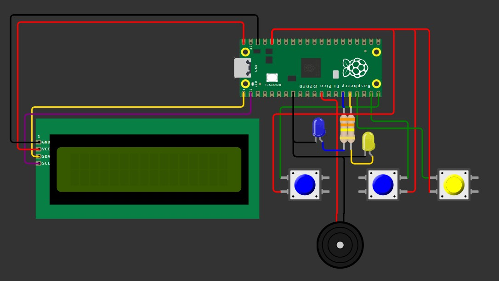

# Pi Pico LCD1602 Menu

## Description

This project is a multi-functional system that includes various modules such as a file explorer, clock, game, LED controller, and volume manager. It is designed to run on a microcontroller with an LCD display, buttons, and a beeper, and is created purely for fun and to explore the capabilities of microcontrollers.

## Features

- **File Explorer**: Navigate and read files.
- **Clock**: Display and manage time.
- **Game**: Play a simple dino game.
- **LED Controller**: Control LED lights.
- **Volume Manager**: Adjust system volume.
- **Text reader**: Read long text with scroll feature.

## Usage

1. Connect your microcontroller to your computer.
2. Upload all files to your microcontroller.
3. Open `main.py` and run the script on your microcontroller or reboot it.
4. Use the buttons to navigate through the menu and select different features.

## Hardware Requirements

- Microcontroller Rapberry Pi Pico
- LCD1602 I2C display
- 3 Buttons
- Active Beeper
- 2 LEDs
- 2 330k resistors